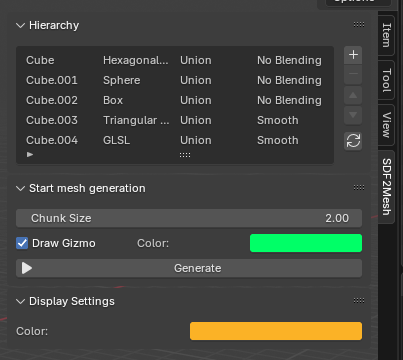
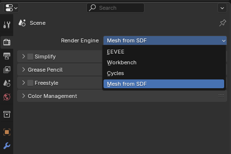
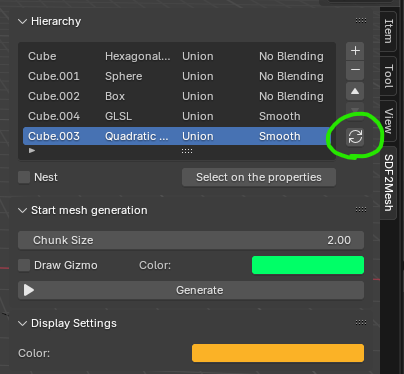
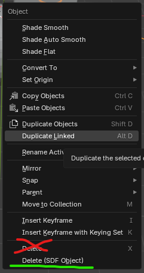

</img>

# Mesh from SDF
Add-on for mesh modeling with SDF in Blender.

<video src="https://github.com/user-attachments/assets/b20142b3-20d9-4de1-8d97-927f9eca7366"></video>

## Features

- Primitives
  - [x] Box
  - [x] Sphere
  - [x] Cylinder
  - [x] Torus
  - [x] Cone
  - [x] Pyramid
  - [x] Truncated Pyramid
  - [x] Hexagonal Prism
  - [ ] ~~Triangular Prism~~ (Removed because it can be replaced by Truncated Pyramid and Ngon Prism)
  - [x] Ngon Prism
  - [x] Spline (Quadratic Bezier)
  - [x] Distance Function (External files written in GLSL format)
- [x] SDF to Mesh Conversion (Based on Marching Cube)
- Boolean Operations 
  - [x] Union
  - [x] Diffrence
  - [x] Intersection
- Blend Types
  - [x] No Blending
  - [x] Smooth
  - [x] Champfer
  - [x] Steps
  - [x] Round
- [ ] Mirror
- [ ] Repeat
- [x] Visualization of bounding boxes

## Screenshots

<video src="https://github.com/user-attachments/assets/3470f581-a11a-4376-96a3-56fd255e6952" width="256"></video>

<video src="https://github.com/user-attachments/assets/0166b8d3-d667-487d-bfa1-d170619a3d51" width="256"></video>

## Requirements
- Blender 4.x (Development and testing is being done with this Blender version)
- Windows 10 / 11 (Not tested on MacOS and Linux)

## Dependent packages
- [moderngl](https://github.com/moderngl/moderngl)

## Installation
1. Drag and drop the zip file downloaded from the repository release page into Blender to install.
2. Activate the installed add-on (mesh_from_sdf) in `Edit/Preference/Add-ons`.

## Start up
1. Select `SDF2Mesh` from the toolbar to open the add-on hierarchy panel.
2. Changed `RenderEngine` to `MeshFromSDF`

3. Switch the 3D View render mode to `Render` or `Material`.
4. Pressing the `reload button` displays the SDF objects registered in the hierarchy (Do this the first time you start Blender or activate this add-on).

## The part to be replaced from the existing operation
### Deleting Objects
Choose one of the following two ways of operation.
1. Select an object of the hierarchy on the Mesh2SDF panel and press the minus button
2. Select `Delete (SDF Object)` instead of `Delete` on the context menu

## Known Issue
- Undo processing is not implemented for Gizmo operations on SDF primitives.
  - While it is possible to always invoke Undo while dragging Gizmo, ideally, Undo should be executed only when the drag ends.
- After changing the type of the SDF primitive once, the previous Gizmo operation is reset when it is changed back again.
- The Quadratic Bezier primitive does not currently support rotation and scaling operations. Changing the value is automatically reset to `rotaiton_euler = (0,0,0)`, `scale = (1,1,1)` afterwards.
- The Quadratic Bezier primitive does not currently support object selection via a mesh proxy, but rather via the three control points defining the Quadratic Bezier and the edge connecting them.
